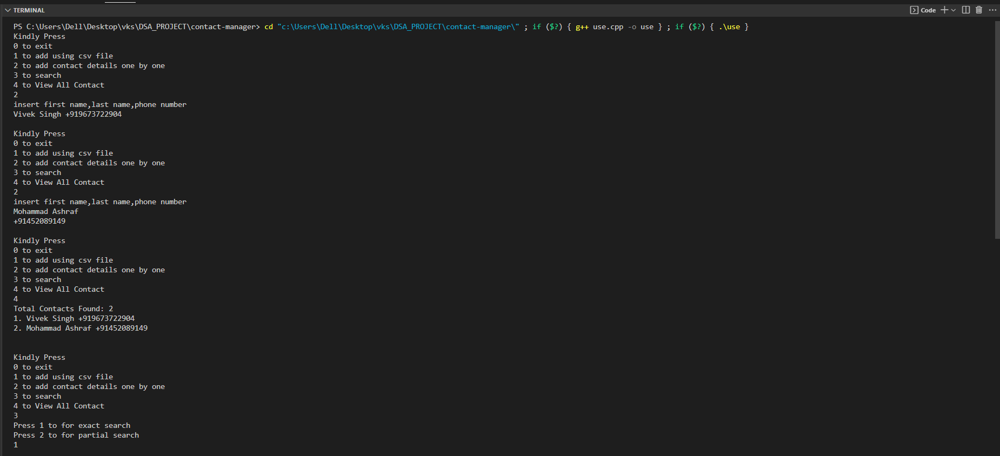
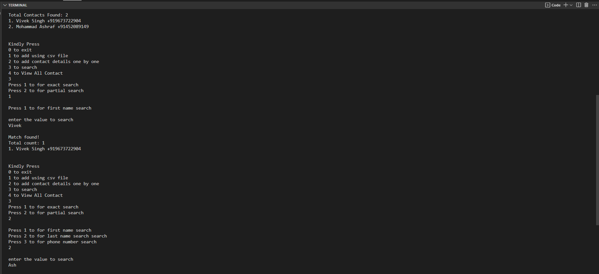
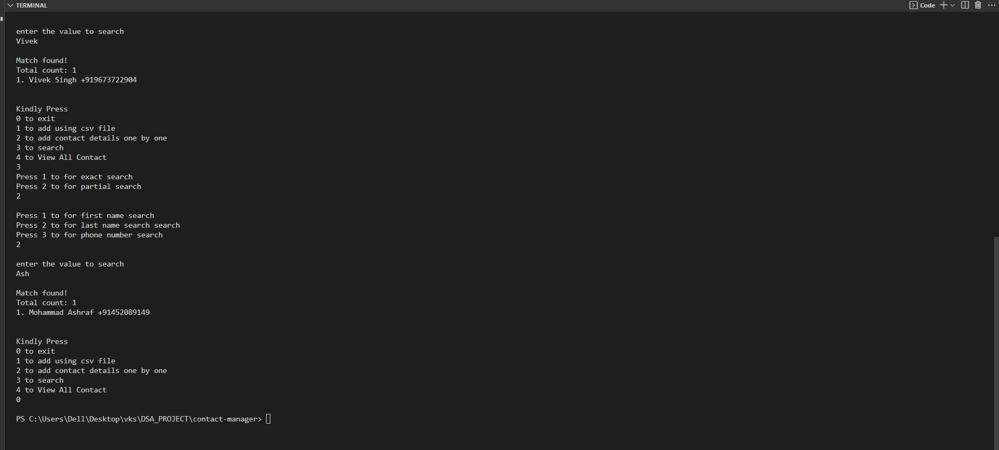

# Contact Book

This is a simple command-line application that allows you to manage contacts. You can add contacts one by one, or import them from a CSV file. You can also search for contacts based on their first name, last name, or phone number.

## Getting Started

### Prerequisites

You need to have C++ compiler and IDE installed on your computer. You can use any C++ compiler and IDE, but we recommend using the [MinGW](http://www.mingw.org/) compiler and [Code::Blocks](http://www.codeblocks.org/) IDE.

### Installing

1. Clone the repository: `git clone https://github.com/thevkscode/Contact-Manager`
2. Open the project in your IDE.
3. Build and run the project.

## Usage

When you run the application, you will be presented with a menu of options:

- Press `0` to exit.
- Press `1` to add contacts from a CSV file.
- Press `2` to add contacts one by one.
- Press `3` to search for a contact.
- Press `4` to view all contacts.

### Adding Contacts from a CSV File

If you choose option `1`, you will be prompted to enter the name of the CSV file. The CSV file should contain the following fields in each row: first name, last name, and phone number. The fields should be separated by commas, and each row should be on a new line.

### Adding Contacts One by One

If you choose option `2`, you will be prompted to enter the first name, last name, and phone number of the contact.

### Searching for a Contact

If you choose option `3`, you will be prompted to choose the search type: exact or partial. You will also be prompted to choose the search field: first name, last name, or phone number. Finally, you will be prompted to enter the search term.

### Viewing All Contacts

If you choose option `4`, you will see a list of all contacts in the phone book.

## Built With

- C++
- visual Studio Code

## Output

## Authors

- Vivek Singh
